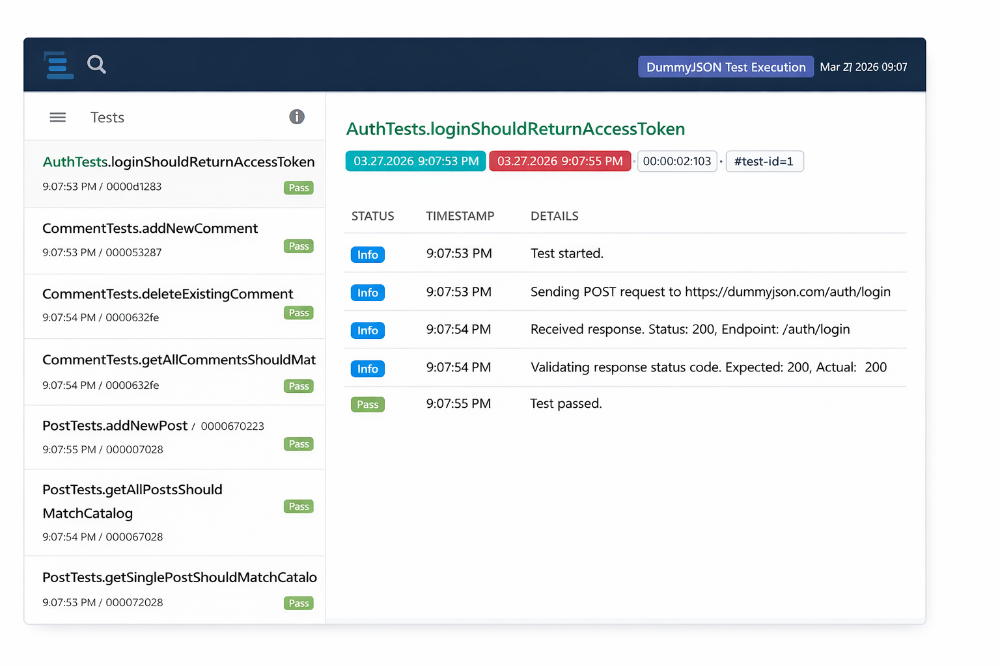
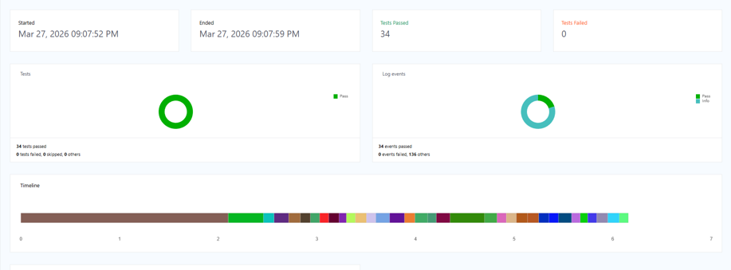

# Backend API Test Automation Framework

This project is a backend API automation framework built with Java, Maven, TestNG, and Rest Assured.

It demonstrates best practices in API test automation, including:
- API test design and execution
- reusable framework structure
- DTO-based request and response handling
- scalable test organization
- logging and reporting
- CI integration
- validation against live API responses

The framework currently targets the public [DummyJSON](https://dummyjson.com/) API and covers multiple resource domains such as products, users, posts, recipes, and comments.

## Tech Stack

- Java 21
- Maven
- TestNG
- Rest Assured
- Jackson
- SLF4J
- Logback
- ExtentReports
- GitHub Actions

## CI Integration

Continuous Integration is configured with GitHub Actions.

The workflow file is located at:

```text
.github/workflows/ci.yml
```

The pipeline runs automatically on:
- push to `master`
- pull requests targeting `master`

What the workflow does:
- checks out the repository
- sets up JDK 21
- caches Maven dependencies
- runs the full TestNG suite with Maven

Workflow command:

```bash
mvn -B test -Dsurefire.suiteXmlFiles=testng.xml
```

## Project Structure

```text
be_automation
|-- .github
|   `-- workflows
|       `-- ci.yml
|-- img
|-- src
|   `-- test
|       |-- java
|       |   `-- dummyjsontestsuite
|       |       |-- auth
|       |       |-- config
|       |       |-- dto
|       |       |-- enums
|       |       |-- reporting
|       |       |-- tests
|       |       `-- utils
|       `-- resources
|           `-- logback-test.xml
|-- pom.xml
`-- testng.xml
```

### Package Responsibilities

- `auth`
  Handles authentication token retrieval.

- `config`
  Stores base URL, HTTP verbs, shared headers, and endpoint builders.

- `dto`
  Contains request and response DTOs for API resources.

- `enums`
  Stores expected catalog data and reusable validation messages.

- `reporting`
  Contains ExtentReports setup and TestNG listener integration.

- `tests`
  Contains executable TestNG test classes.

- `utils`
  Contains reusable API request helpers and response status validation.

## Implemented Test Coverage

### Auth
- login and token retrieval

### Products
- get all products
- get single product
- search products
- add product
- update product
- delete product

### Users
- get all users
- get single user
- search users
- add user
- update user
- delete user

### Posts
- get all posts
- get single post
- search posts
- add post
- update post
- delete post

### Recipes
- get all recipes
- get single recipe
- search recipes
- add recipe
- update recipe
- delete recipe

### Comments
- get all comments
- get single comment
- get comments by post id
- add comment
- update comment
- delete comment

## Framework Design Highlights

### 1. DTO-Based Validation

Instead of relying only on the standard `jsonPath`, the framework uses DTOs for request and response mapping. This improves readability, reduces fragile string-based access, and keeps validations closer to a real automation framework design.

### 2. Shared Base Test

`BaseTest` provides:
- shared authentication setup
- reusable decimal tolerance
- common step logging

### 3. Centralized Config

`DummyJsonConfig` centralizes:
- base URL
- endpoint builders
- shared headers
- common HTTP verbs

### 4. Logging

The framework uses:
- Rest Assured logging for detailed request and response visibility
- SLF4J + Logback for readable step-level execution logs

### 5. Reporting

ExtentReports is integrated through a TestNG listener and generates an HTML execution report after the test run.

Report location:

```text
target/extent-reports/dummyjson-suite-report.html
```

## Extent Report Screenshots

### Dashboard



### Chart View



## How To Run

### Run the full suite with Maven

```powershell
mvn test
```

### Run the suite using TestNG XML

```powershell
mvn test -Dsurefire.suiteXmlFiles=testng.xml
```

### Run from IntelliJ

You can run:
- individual test classes
- individual test methods
- the full `testng.xml` suite

### Contributing

Contributions are welcome. Feel free to open issues or submit pull requests if you find bugs or have suggestions for improvements.
